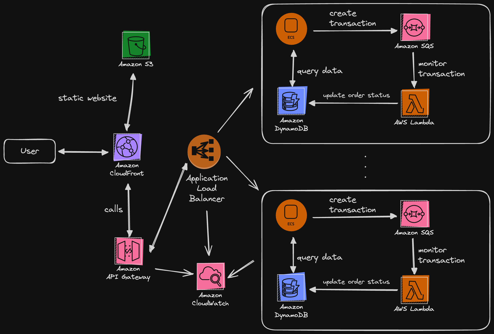
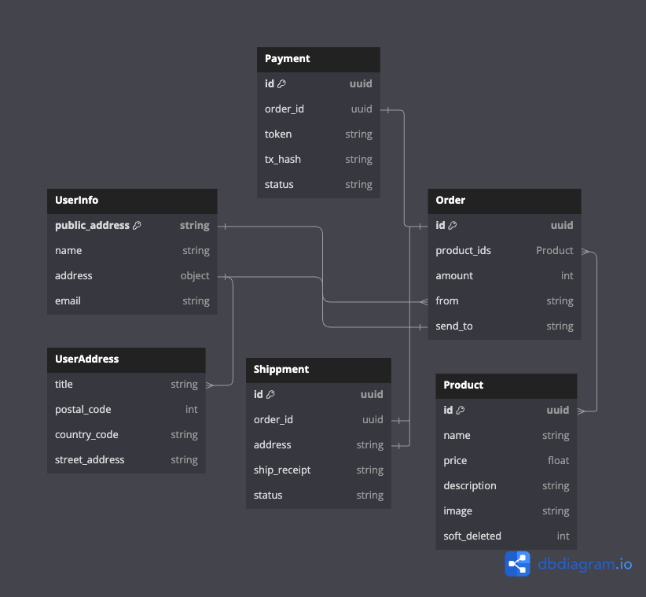

# E-commerce

## Basic Architecture Design

## Entity Relationship Diagram

## Table
### Get
| #   | access pattern          | target                | action   | pk                    | sk                        | done               |
| --- | ----------------------- | --------------------- | -------- | --------------------- | ------------------------- | ------------------ |
| 1   | get user information    | table                 | get item | USER#`public_address` | #PROFILE#`public_address` | :white_check_mark: |
| 2   | get all products        | GSI-soft_delete_index | scan     | `soft_deleted` exist  |                           | :white_check_mark: |
| 3   | get orders of user      | table                 | query    | USER#`public_address` | BeginWith ORDER#          | :white_check_mark: |
| 4   | get product information | table                 | get item | PRODUCT#`product_id`  | #PROFILE#`product_id`     | :white_check_mark: |
| 5   | get order               | table                 | get item | USER#`public_address` | ORDER#`order_id`          | :white_check_mark: |

### Set
| #   | access pattern           | target | action   | pk                    | sk                        | done               |
| --- | ------------------------ | ------ | -------- | --------------------- | ------------------------- | ------------------ |
| 1   | set new user information | table  | put item | USER#`public_address` | #PROFILE#`public_address` | :white_check_mark: |
| 2   | set new order            | table  | put item | USER#`public_address` | ORDER#`order_id`          | :white_check_mark: |
| 3   | set product information  | table  | put item | PRODUCT#`product_id`  | #PROFILE#`product_id`     | :white_check_mark: |

### Update
| #   | access pattern             | target | action      | pk                    | sk                        | done               |
| --- | -------------------------- | ------ | ----------- | --------------------- | ------------------------- | ------------------ |
| 1   | update user information    | table  | update item | USER#`public_address` | #PROFILE#`public_address` | :white_check_mark: |
| 2   | update order status        | table  | update item | USER#`public_address` | ORDER#`order_id`          | :white_check_mark: |
| 3   | update product information | table  | update item | PRODUCT#`product_id`  | #PROFILE#`product_id`     | :white_check_mark: |

## Endpoints

### Auth
| #   | action    | method | header | endpoint       | body            | return    | done               |
| --- | --------- | ------ | ------ | -------------- | --------------- | --------- | ------------------ |
| 1   | register  | POST   |        | /auth/register | user basic info |           | :white_check_mark: |
| 2   | get token | POST   |        | /auth/token    | signature       | jwt token | :white_check_mark: |

### User
| #   | action           | method | header    | endpoint   | body                    | return          | done               |
| --- | ---------------- | ------ | --------- | ---------- | ----------------------- | --------------- | ------------------ |
| 1   | get user info    | GET    | basic_jwt | /user/info |                         | user basic info | :white_check_mark: |
| 2   | update user info | PATCH  | basic_jwt | /user/info | user info & update_mask | user basic info | :white_check_mark: |

### Product
| #   | action                  | method | header    | endpoint                    | body                       | return                | done               |
| --- | ----------------------- | ------ | --------- | --------------------------- | -------------------------- | --------------------- | ------------------ |
| 1   | get all product         | GET    |           | /product/list               |                            | products & next_token | :white_check_mark: |
| 2   | get detail product info | GET    |           | /product/`product_id`       |                            | product info          | :white_check_mark: |
| 3   | create product          | POST   | admin_jwt | /admin/product/create       | product info               | product info          | :white_check_mark: |
| 4   | update product info     | PATCH  | admin_jwt | /admin/product/`product_id` | product info & update_mask | product info          | :white_check_mark: |

### Order
| #   | action             | method | header    | endpoint                | body       | return     | done               |
| --- | ------------------ | ------ | --------- | ----------------------- | ---------- | ---------- | ------------------ |
| 1   | create order       | POST   | basic_jwt | /order/create           | order info | order_id   | :white_check_mark: |
| 2   | get orders of user | GET    | basic_jwt | /order/list             |            | orders     | :white_check_mark: |
| 3   | get order          | GET    | basic_jwt | /order/`orderId`        |            | order info | :white_check_mark: |
| 4   | cancel order       | GET    | basic_jwt | /order/cancel/`orderId` |            |            | :white_check_mark: |

### Payment
| #   | action    | method | header    | endpoint     | body     | return     | done               |
| --- | --------- | ------ | --------- | ------------ | -------- | ---------- | ------------------ |
| 1   | pay order | POST   | basic_jwt | /payment/pay | pay info | payment_tx | :white_check_mark: |

